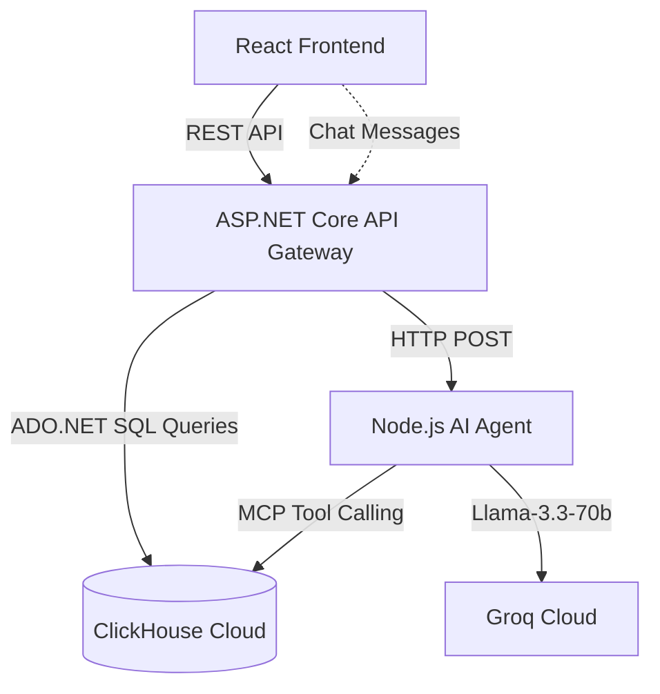

# 🎬 Studio-in-a-Box: Enterprise Command Center


Welcome to **Studio-in-a-Box**! This is a professional Hackathon project designed to analyze thousands of movie budgets and box office returns in real-time. It features an interactive **OLED Data Explorer** and an **Autonomous AI Director** powered by the Llama-3 model and ClickHouse Cloud.

---

## 🏗️ How it Works (Architecture)



---

## 🛠️ Prerequisites
Before running this project on your computer, ensure you have the following installed:
1. **Node.js** (v18 or higher)
2. **.NET 8.0 SDK** (For the C# Backend)

---

## 🔑 Step 1: Set Up Your Secret Keys
Because this is a secure enterprise app, you must configure your API keys locally. **Do not skip this step!**

### 1. The AI Agent Key (Groq)
Navigate to the `agent/` folder and create a file named `.env`.
Inside the `.env` file, paste your Groq API key exactly like this:
```env
GROQ_API_KEY=gsk_your_actual_api_key_here
```

### 2. The Database Credentials (ClickHouse)
Navigate to the `backend/` folder and open the `appsettings.json` file.
Ensure your ClickHouse section looks exactly like this with your live credentials:
```json
  "ClickHouse": {
    "Host": "o0he6njq3a.ap-northeast-1.aws.clickhouse.cloud",
    "Port": "8443",
    "Database": "studio_in_a_box",
    "Username": "default",
    "Password": "REqBo_39_eGpO"
  }
```

---

## 🚀 Step 2: How to Run the Project
This project uses a **microservices architecture**, which means you have to run three separate servers. 
**Open three separate PowerShell terminals.**

### Terminal 1: Run the AI Agent (Node.js)
This server acts as the AI Brain and runs on **Port 3001**.
```powershell
cd cinema
cd agent
npm install
npm start
```
*(Leave this terminal open and running)*

### Terminal 2: Run the API Gateway (ASP.NET Core)
This server talks to ClickHouse and acts as the middleman. It runs on **Port 5000**.
```powershell
cd cinema
cd backend
dotnet run
```
*(Wait until it says "Now listening on: http://localhost:5000", then leave it running)*

### Terminal 3: Run the User Interface (React)
This is the beautiful dashboard you will interact with.
```powershell
cd cinema
cd frontend
npm install
npm run dev
```
Once this finishes, it will give you a local URL (e.g., `http://localhost:5173/`). 
**Ctrl+Click that link to open the dashboard in your browser!**

---

## 💡 Troubleshooting
- **Dashboard is blank?** Your C# Backend (Terminal 2) is probably not running. Restart it with `dotnet run` and refresh the page.
- **AI Agent throws an error?** Ensure your `GROQ_API_KEY` is pasted correctly in `agent/.env` and that Terminal 1 is running without errors.
- **Can't push to GitHub?** Ensure you don't commit your `.env` files. The included `.gitignore` handles this automatically for you.
