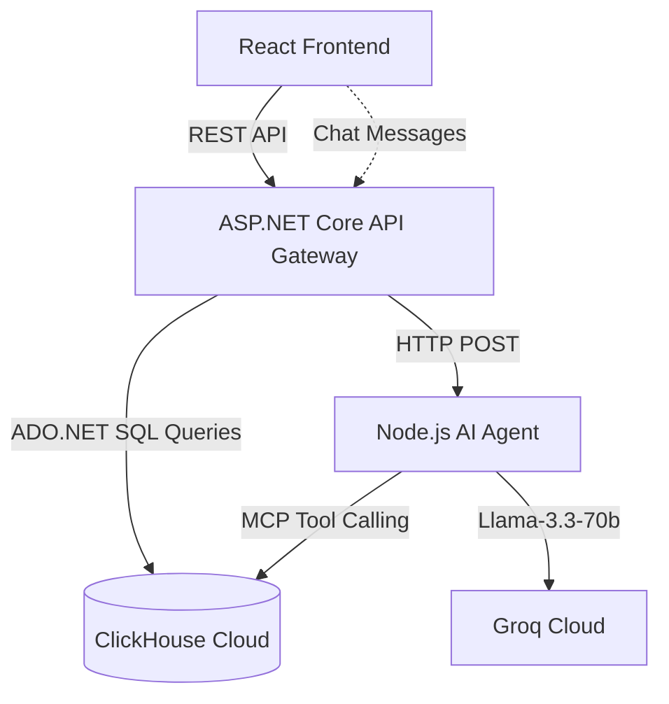

# 🎬 Studio-in-a-Box


An enterprise-grade studio operations and analytics command center. Built for the Hackathon, this system leverages **ClickHouse Cloud** for massive real-time analytical workloads, orchestrated by an autonomous AI Director Agent powered by **Groq** and the **Model Context Protocol (MCP)**.

## 🏗️ Architecture



## ✨ Features
- **Enterprise Data Explorer:** Real-time filtering and visualization of thousands of movie budgets and box office returns.
- **AI Director Assistant:** An autonomous AI agent capable of writing and executing complex ClickHouse SQL queries via MCP.
- **OLED Dark Mode:** A production-ready, minimalist dashboard design engineered for data density and clarity.

## 🚀 Installation & Setup

This project uses a microservices architecture. You will need three separate terminal instances to run the full stack.

### 1. The ASP.NET Core Backend (Port 5000)
This acts as the API Gateway and Data Access Layer.
```bash
cd backend
dotnet run
```

### 2. The Node.js Agent (Port 3001)
The AI brain powering the conversational analytics.
```bash
cd agent
npm install
npm start
```
*Note: Ensure your `.env` file contains your `GROQ_API_KEY`.*

### 3. The React Frontend (Port 5173)
The enterprise dashboard UI.
```bash
cd frontend
npm install
npm run dev
```

## 🔒 Environment Variables
Never commit your `.env` files or `appsettings.json` secrets. The `.gitignore` is pre-configured for security.

Required in `agent/.env`:
`GROQ_API_KEY=your_key_here`

Required in `backend/appsettings.json`:
```json
"ClickHouse": {
  "Host": "your_clickhouse_host",
  "Password": "your_password"
}
```
