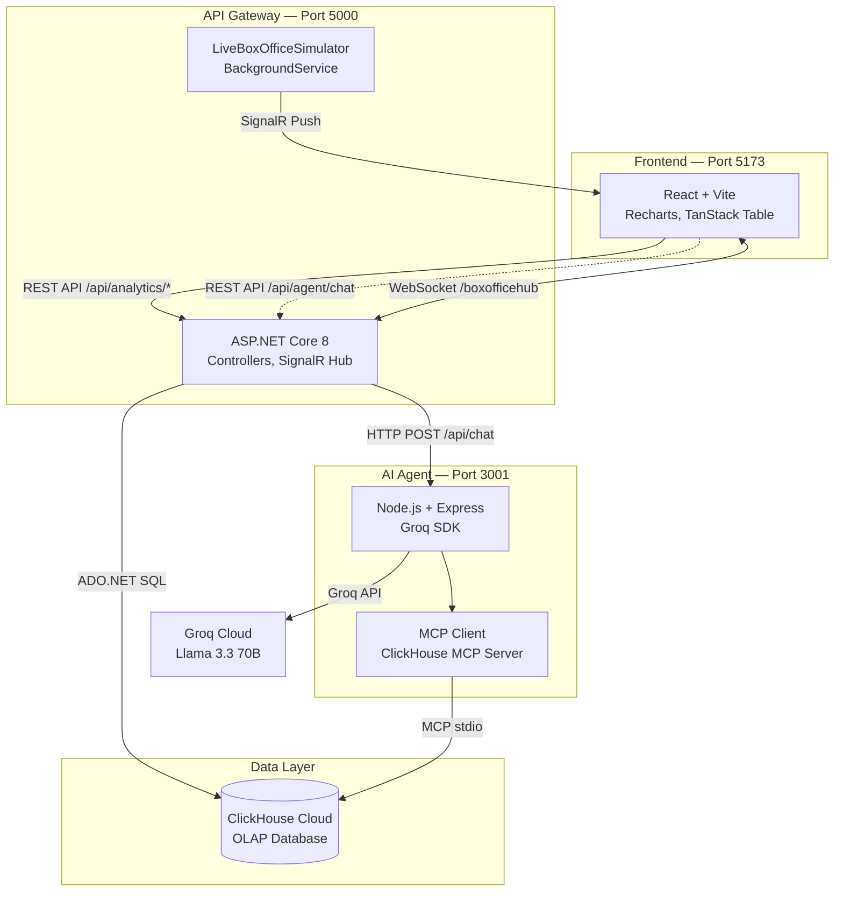
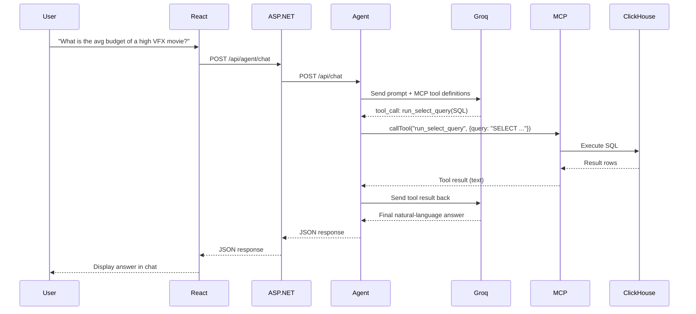

# 🎬 Studio-in-a-Box

> **AI-powered agentic pre-production intelligence platform**
> Built with Groq, ASP.NET Core, React & ClickHouse Cloud


---

## 🎬 Overview

**Studio-in-a-Box** is an enterprise-grade analytics command center for the film industry. It allows studio executives, producers, and VFX supervisors to instantly analyze historical production data across thousands of movies and make data-driven pre-production decisions.

At the heart of the platform is an **autonomous AI Director Agent** — a Groq-powered LLM that can independently write, execute, and interpret complex SQL queries against a ClickHouse Cloud data warehouse using the **Model Context Protocol (MCP)**. Instead of manually querying databases, users simply ask the AI a natural-language question like _"What is the average budget of a high VFX sci-fi movie?"_ — and the agent autonomously plans and executes the correct ClickHouse queries to answer it.

---

## 🚨 Problem

Film pre-production is one of the most financially risky phases in the entertainment industry. Studios routinely greenlight $100M+ projects based on gut instinct rather than data. Key pain points include:

- **No centralized analytics:** Budget benchmarks, box office comparisons, and scene-level cost breakdowns live in disconnected spreadsheets and legacy systems.
- **Slow decision-making:** Producers must wait days for analysts to manually compile comparison reports.
- **Lack of AI assistance:** Existing tools don't offer intelligent, conversational access to production data.

---

## 💡 Solution

Studio-in-a-Box solves this by combining three powerful capabilities into a single platform:

1. **Real-time OLAP analytics** powered by ClickHouse Cloud, capable of scanning thousands of movies and tens of thousands of scene records in milliseconds.
2. **An autonomous AI agent** powered by Groq (Llama 3.3 70B) that can independently decide which database tools to call, execute the queries, interpret the results, and deliver plain-English answers.
3. **A live enterprise dashboard** with interactive SVG charts (Recharts), sortable data grids (TanStack Table), and real-time WebSocket telemetry (SignalR) streaming live box office simulations directly to the browser.

---

## ✨ Key Features

| Feature | Description |
|---|---|
| **AI Director Agent** | Conversational AI that autonomously writes and executes ClickHouse SQL via MCP tool calling |
| **Interactive Charts** | SVG-based bar charts and area charts with hover tooltips (Recharts) |
| **Enterprise Data Grid** | Sortable, filterable data table powered by TanStack React Table |
| **Live Telemetry** | SignalR WebSocket connection streams simulated global box office sales to the dashboard in real time |
| **OLED Dark Mode** | Clean, minimalist design with a physical Light/Dark theme toggle |
| **Genre Filtering** | Dropdown controls to filter movies by Genre (Sci-Fi, Action, Drama, Comedy, Horror) and VFX Intensity (Low, Medium, High) |
| **KPI Dashboard** | Aggregated metrics: Total Box Office, Total Budgets, Global ROI, and Movie Count |
| **Scene Benchmarks** | Median and maximum scene production costs broken down by VFX intensity |

---

## 🏗️ Architecture

The platform follows a **microservices architecture** with three independently deployable services communicating over HTTP and WebSockets:



**Data Flow:**
1. The **React frontend** sends REST requests to the ASP.NET Core API Gateway.
2. The **API Gateway** either queries ClickHouse directly via ADO.NET (for dashboard data) or proxies chat messages to the Node.js Agent.
3. The **AI Agent** receives the user's question, sends it to **Groq** (Llama 3.3 70B), and Groq autonomously decides which **MCP tools** to invoke against ClickHouse.
4. The **SignalR BackgroundService** continuously pushes simulated live ticket sales to all connected frontend clients via WebSocket.

---

## 🔄 Agent Workflow

When a user sends a message to the AI Director, the following agentic loop executes:



The agent supports up to **5 consecutive tool calls** per request, allowing multi-step reasoning (e.g., first listing tables, then querying a specific one).

---

## 🤖 Director Agent

The Director Agent is a Node.js Express server that orchestrates the AI reasoning loop.

**Key implementation details:**
- **LLM:** Groq Cloud API with `llama-3.3-70b-versatile` model
- **MCP Client:** Official `@modelcontextprotocol/sdk` connecting to `@clickhouse/mcp-server` via stdio transport
- **Tool Name Sanitization:** ClickHouse MCP tool names contain special characters. The agent sanitizes names to comply with OpenAI function-calling format and maintains a reverse lookup map.
- **System Prompt:** The agent is instructed to _"always use the tools provided to query ClickHouse to gather facts and budget averages before giving your final answer."_
- **Safety:** A `maxToolCalls = 5` guard prevents infinite tool-calling loops.

---

## 🔌 ClickHouse MCP Integration

The **Model Context Protocol (MCP)** is the bridge between the AI agent and the ClickHouse database. Instead of hardcoding SQL queries, the LLM dynamically generates them.

**How it works:**
1. The agent launches `@clickhouse/mcp-server` as a subprocess via `StdioClientTransport`.
2. On startup, it calls `mcpClient.listTools()` to discover all available ClickHouse operations (e.g., `run_select_query`, `list_tables`).
3. These tools are converted to OpenAI-compatible function definitions and passed to Groq with every chat request.
4. Groq decides which tools to call and with what arguments (e.g., the exact SQL query string).
5. The agent executes the tool via `mcpClient.callTool()` and feeds the result back to Groq.

**Environment variables required for the MCP connection:**
```env
CLICKHOUSE_URL=https://your-host.clickhouse.cloud:8443
CLICKHOUSE_USERNAME=default
CLICKHOUSE_PASSWORD=your_password
```

---

## ☁️ Google Cloud Architecture

This project is designed to run on Google Cloud Platform:

| Component | GCP Service |
|---|---|
| React Frontend | Cloud Run (containerized static build) |
| ASP.NET Core Backend | Cloud Run (containerized .NET 8 app) |
| Node.js Agent | Cloud Run (containerized Node.js app) |
| Database | ClickHouse Cloud (hosted on GCP, `ap-northeast-1`) |
| AI Inference | Groq Cloud (external API, Llama 3.3 70B) |
| Secrets Management | Google Secret Manager (for API keys & DB credentials) |

---

## 🛠️ Technology Stack

### Frontend
| Technology | Purpose |
|---|---|
| React 18 | Component-based UI framework |
| Vite 5 | Build tool and dev server with HMR |
| TypeScript | Type-safe JavaScript |
| Recharts | SVG-based interactive data visualizations |
| TanStack React Table | Headless, sortable enterprise data grid |
| @microsoft/signalr | WebSocket client for real-time telemetry |

### Backend (API Gateway)
| Technology | Purpose |
|---|---|
| ASP.NET Core 8 | High-performance C# web API framework |
| ClickHouse.Client | ADO.NET provider for ClickHouse |
| SignalR | WebSocket server for real-time push notifications |
| HttpClient | Proxy layer to forward requests to the Agent |

### AI Agent
| Technology | Purpose |
|---|---|
| Node.js 20 | JavaScript runtime for the agent service |
| Express 4 | HTTP server framework |
| groq-sdk | Official Groq API client for Llama 3.3 70B |
| @modelcontextprotocol/sdk | MCP client for tool calling |
| @clickhouse/mcp-server | Official ClickHouse MCP tool server |

### Data Layer
| Technology | Purpose |
|---|---|
| ClickHouse Cloud | Columnar OLAP database for sub-second analytical queries |

---

## 📁 Project Structure

```
studio-in-a-box/
├── agent/                          # AI Director Agent (Node.js)
│   ├── index.js                    # Express server + Groq + MCP orchestration
│   ├── package.json                # Dependencies: groq-sdk, @modelcontextprotocol/sdk
│   ├── .env                        # Secret keys (gitignored)
│   └── .env.example                # Template for required environment variables
│
├── backend/                        # API Gateway (ASP.NET Core 8)
│   ├── Program.cs                  # App configuration: CORS, SignalR, DI registration
│   ├── Controllers/
│   │   ├── AnalyticsController.cs  # GET /api/analytics/dashboard, /movies, /test
│   │   ├── AgentController.cs      # POST /api/agent/chat (proxy to Node.js agent)
│   │   └── HealthController.cs     # GET /api/health
│   ├── Services/
│   │   ├── IMovieAnalyticsService.cs   # Service interface (DI abstraction)
│   │   └── LiveBoxOfficeSimulator.cs   # BackgroundService for SignalR telemetry
│   ├── Infrastructure/
│   │   └── ClickHouse/
│   │       └── ClickHouseAnalyticsService.cs  # ADO.NET queries against ClickHouse
│   ├── Models/
│   │   ├── Movie.cs                # Movie entity (14 fields)
│   │   └── Scene.cs                # Scene entity (12 fields)
│   ├── DTOs/Analytics/             # Strongly-typed response objects
│   ├── Hubs/
│   │   └── BoxOfficeHub.cs         # SignalR WebSocket hub
│   ├── appsettings.json            # ClickHouse connection config (gitignored values)
│   └── appsettings.example.json    # Template for required configuration
│
├── frontend/                       # Dashboard UI (React + Vite)
│   ├── src/
│   │   ├── App.tsx                 # Root component with theme toggle
│   │   ├── main.tsx                # React entry point
│   │   ├── index.css               # Complete design system (Light + OLED Dark)
│   │   └── components/
│   │       ├── Dashboard.tsx       # KPI cards, Recharts, SignalR live connection
│   │       ├── DataExplorer.tsx    # TanStack Table with genre/VFX filters
│   │       └── ChatWidget.tsx      # AI Director chat interface
│   ├── index.html                  # HTML entry point
│   └── package.json                # Dependencies: recharts, @tanstack/react-table, signalr
│
├── data/
│   └── seed/
│       ├── 01_schema.sql           # ClickHouse DDL (movies + scenes tables)
│       ├── 02_seed.sql             # 150 synthetic movies + scenes (1.9 MB)
│       └── generate_seed.js        # Node.js script to regenerate seed data
│
├── docs/
│   └── architecture.md             # Technical architecture documentation
│
├── docker-compose.yml              # Local ClickHouse development container
├── .gitignore                      # Excludes node_modules, .env, bin, obj
└── README.md                       # This file
```

---

## 🗄️ Data Architecture

### ClickHouse Schema

The database contains two tables using ClickHouse's `MergeTree` engine, optimized for analytical queries:

**`movies` table** — 150 synthetic records, 14 columns:
```sql
CREATE TABLE movies (
    movie_id UUID,
    title String,
    genre String,                    -- Sci-Fi, Action, Drama, Comedy, Horror
    release_year UInt16,
    production_budget Float64,       -- Total production cost in USD
    box_office Float64,              -- Total worldwide gross in USD
    marketing_budget Float64,
    runtime_minutes UInt16,
    scene_count UInt16,
    location_count UInt16,
    cast_size UInt16,
    vfx_intensity String,            -- Low, Medium, High
    opening_weekend Float64,
    international_box_office Float64
) ENGINE = MergeTree()
ORDER BY (genre, release_year);
```

**`scenes` table** — Thousands of scene-level records, 12 columns:
```sql
CREATE TABLE scenes (
    scene_id UUID,
    movie_id UUID,                   -- Foreign key to movies
    scene_number UInt16,
    location_type String,
    indoor_outdoor String,
    time_of_day String,
    character_count UInt16,
    prop_count UInt16,
    vfx_intensity String,            -- Low, Medium, High
    special_equipment UInt16,
    estimated_scene_cost Float64,    -- Individual scene production cost
    production_complexity String
) ENGINE = MergeTree()
ORDER BY (movie_id, scene_number);
```

### Key Analytical Queries

The backend executes the following ClickHouse queries:

| Query | Description |
|---|---|
| `AVG(production_budget) GROUP BY vfx_intensity` | Average budget segmented by VFX intensity |
| `SUM(box_office), SUM(production_budget) WHERE genre = ?` | Total box office and budget by genre |
| `MEDIAN(estimated_scene_cost) WHERE vfx_intensity = ?` | Median scene production cost by VFX level |
| `SELECT * WHERE genre = ? AND vfx_intensity = ?` | Filtered movie lookup for the data grid |

---

## 🔐 Security

- **`.env` files are gitignored** — API keys and database passwords are never committed to the repository.
- **`.env.example` and `appsettings.example.json`** are provided as templates so collaborators know which secrets are required without exposing actual values.
- **Parameterized SQL queries** — All ClickHouse queries use parameterized inputs (`{genre:String}`) to prevent SQL injection.
- **CORS** is configured to allow cross-origin requests between the frontend and backend during development.

---

## 🚀 Local Development

### Prerequisites
| Tool | Version | Purpose |
|---|---|---|
| Node.js | v18+ | Runs the AI Agent and Frontend |
| .NET SDK | 8.0+ | Runs the ASP.NET Core Backend |
| npm | v9+ | Package management |

### Step-by-step Setup

**1. Clone the repository:**
```bash
git clone https://github.com/Nav33dCodes/studio-in-a-box.git
cd studio-in-a-box
```

**2. Configure secrets:**
```bash
# Copy the example env file and paste your Groq API key
cp agent/.env.example agent/.env

# Copy the example config and paste your ClickHouse credentials
cp backend/appsettings.example.json backend/appsettings.json
```

**3. Install dependencies:**
```bash
# Agent dependencies
cd agent && npm install && cd ..

# Frontend dependencies
cd frontend && npm install && cd ..
```

**4. Start the three microservices (each in a separate terminal):**

| Terminal | Command | Port |
|---|---|---|
| Terminal 1 | `cd agent && npm start` | `http://localhost:3001` |
| Terminal 2 | `cd backend && dotnet run` | `http://localhost:5000` |
| Terminal 3 | `cd frontend && npm run dev` | `http://localhost:5173` |

**5. Open the dashboard:**
Navigate to `http://localhost:5173` in your browser.

---

## ⚙️ Configuration

### Agent (`agent/.env`)
```env
GROQ_API_KEY=gsk_your_groq_api_key_here
CLICKHOUSE_URL=https://your-host.clickhouse.cloud:8443
CLICKHOUSE_USERNAME=default
CLICKHOUSE_PASSWORD=your_clickhouse_password
```

### Backend (`backend/appsettings.json`)
```json
{
  "ClickHouse": {
    "Host": "your-host.clickhouse.cloud",
    "Port": "8443",
    "Database": "studio_in_a_box",
    "Username": "default",
    "Password": "your_clickhouse_password"
  }
}
```

---

## ☁️ Deployment

For production, each microservice can be containerized and deployed to Google Cloud Run:

```bash
# Build and deploy the backend
cd backend
gcloud run deploy studio-backend --source . --region us-central1

# Build and deploy the agent
cd agent
gcloud run deploy studio-agent --source . --region us-central1

# Build and deploy the frontend
cd frontend
npm run build
gcloud run deploy studio-frontend --source . --region us-central1
```

---

## 🧪 Testing & Verification

### Test the AI Agent directly:
```bash
curl -X POST http://localhost:3001/api/chat \
  -H "Content-Type: application/json" \
  -d '{"message": "What is the average budget of a high VFX movie?"}'
```

### Test the Backend API:
```bash
# Health check
curl http://localhost:5000/api/health

# Dashboard analytics
curl http://localhost:5000/api/analytics/dashboard

# Filtered movie data
curl "http://localhost:5000/api/analytics/movies?genre=Sci-Fi&vfxIntensity=High"
```

### Test the full stack:
1. Open `http://localhost:5173` in your browser.
2. Verify the KPI cards show populated data.
3. Hover over the Recharts bar chart to confirm interactive tooltips.
4. Click a column header in the Data Grid to confirm sorting.
5. Watch the "Total Box Office (Live)" number increment in real time via SignalR.
6. Type a question in the AI Chat widget and confirm the agent responds with data.

---

## 📊 Example Workflow

**Scenario:** A producer wants to budget a new high-VFX Sci-Fi movie.

1. **Dashboard View:** The producer opens the Command Center and sees that the average budget for high-VFX movies is $180M, with a +42% average ROI.
2. **Data Explorer:** They filter the grid to "Sci-Fi" + "High VFX" and sort by ROI descending to see which comparable movies performed best.
3. **AI Chat:** They ask the AI Director: _"Which Sci-Fi movie had the highest box office return relative to its budget?"_ — The agent autonomously writes a ClickHouse query, executes it, and responds with a specific movie title and its financials.
4. **Live Telemetry:** While analyzing, the dashboard's live WebSocket feed shows simulated global ticket sales incrementing in real time, demonstrating the platform's real-time streaming capability.

---

## 🎥 Demo

To demonstrate the platform during a live presentation:

1. **Start all three services** using the commands in the Local Development section.
2. **Show the OLED Dark Mode** dashboard — toggle Light/Dark mode using the button in the top-right corner.
3. **Hover over the charts** to show interactive Recharts tooltips displaying precise billion-dollar figures.
4. **Click the "ROI (%)" column header** in the Data Grid to demonstrate client-side sorting via TanStack Table.
5. **Watch the Live Telemetry** — point to the blinking "Live: +$35,000 (North America)" indicator in the header. This proves a real SignalR WebSocket connection is running.
6. **Ask the AI a question** like _"Compare the budgets of Action vs Sci-Fi movies"_ — watch the terminal output as Groq autonomously selects and executes MCP tools against ClickHouse.

---

## 🏆 Hackathon Alignment

This project was built for the **Google Cloud Hackathon** and directly addresses the judging criteria:

| Criteria | How We Address It |
|---|---|
| **Use of ClickHouse** | Core OLAP data warehouse powering all analytics — direct ADO.NET queries from ASP.NET Core AND autonomous MCP tool calling from the AI agent |
| **Innovation** | An autonomous AI agent that writes its own SQL queries via MCP, rather than using hardcoded analytics |
| **Technical Complexity** | Full-stack microservices architecture (React + ASP.NET Core + Node.js) with WebSocket telemetry, interactive SVG charts, and sortable data grids |
| **Real-world Applicability** | Directly applicable to the $300B+ global film industry for pre-production budgeting and competitive analysis |
| **Scalability** | ClickHouse Cloud can scale to billions of rows; the architecture supports horizontal scaling via containerized microservices on Google Cloud Run |

---

## 📈 Future Roadmap

- [ ] **AG Grid Enterprise** — Replace TanStack Table with AG Grid for CSV/Excel export, column pinning, and virtualized scrolling over millions of rows.
- [ ] **Real ClickHouse Streaming** — Replace the simulated `LiveBoxOfficeSimulator` with actual ClickHouse materialized views that stream aggregated data changes.
- [ ] **LangChain Integration** — Upgrade the agent to a multi-step LangChain workflow that can generate PDF reports and email them to stakeholders.
- [ ] **Auth0 RBAC** — Add Role-Based Access Control so studio executives, VFX supervisors, and producers see different dashboard views.
- [ ] **Multi-tenant Support** — Allow multiple studios to run isolated instances against their own ClickHouse databases.

---

## 🤝 Contributing

1. Fork the repository
2. Create a feature branch (`git checkout -b feature/your-feature`)
3. Commit your changes (`git commit -m 'Add your feature'`)
4. Push to the branch (`git push origin feature/your-feature`)
5. Open a Pull Request

---

## 📄 License

This project is licensed under the MIT License. See the `LICENSE` file for details.

---

<p align="center">
  Built with ❤️ for the Google Cloud Hackathon
</p>
